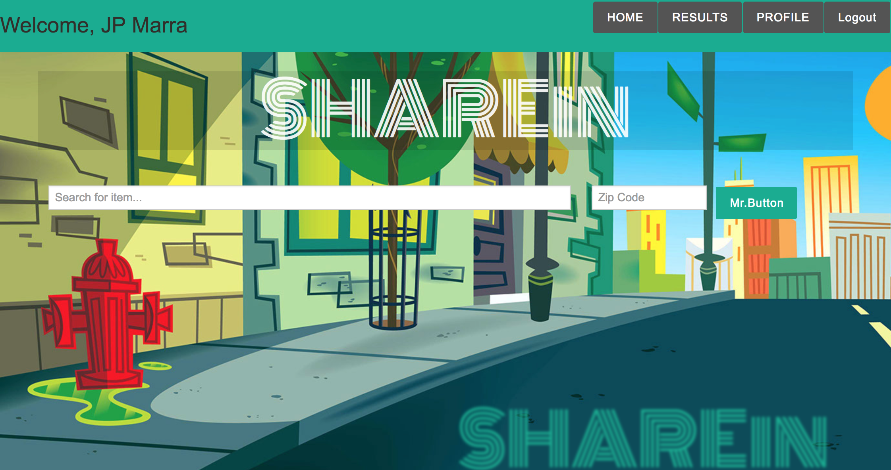
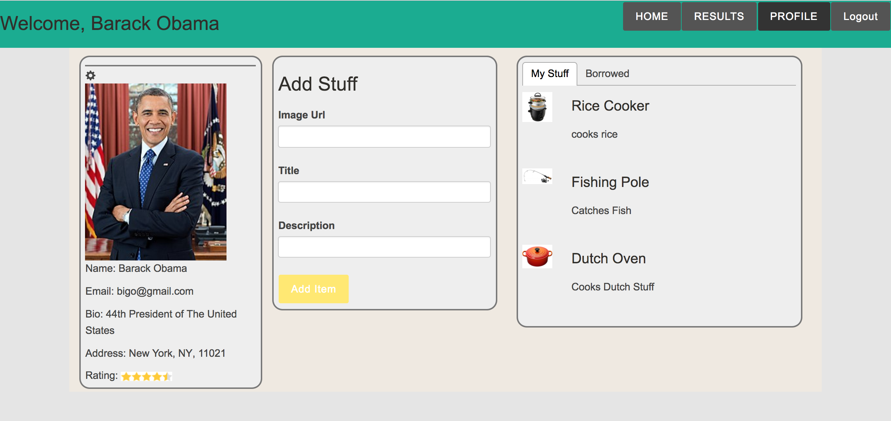
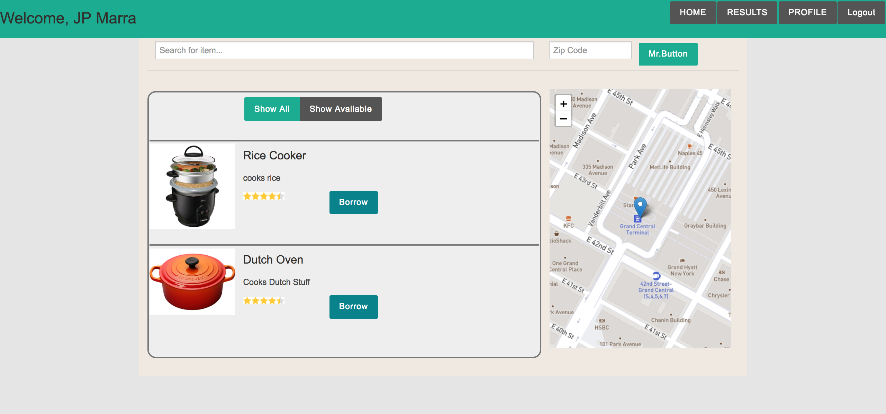

# ShareIn

ShareIn is a social application and marketplace allowing neighbors to easily share and borrow items from one another. Users can list items that are available for borrowing, search for items in their neighborhoods, and contact the owners of those items via SMS messaging.

# Required Files

###Private folder on root directory containing: 

####apiKeys.js with variables named: 
- `sid` (from twilio),
- `authorizationCode` (twilio),
- `twilioNumber`,
- `GOOGLE_API_KEY` (google maps geo coding api)

#### dbconfig.js containig variables named:
- `databaseOptions` = { dialect: 'postgres', logging: false, pool: {max: 5,min: 0,idle: 10000,}}
- `databaseUrl` = given by postgreSQL host
